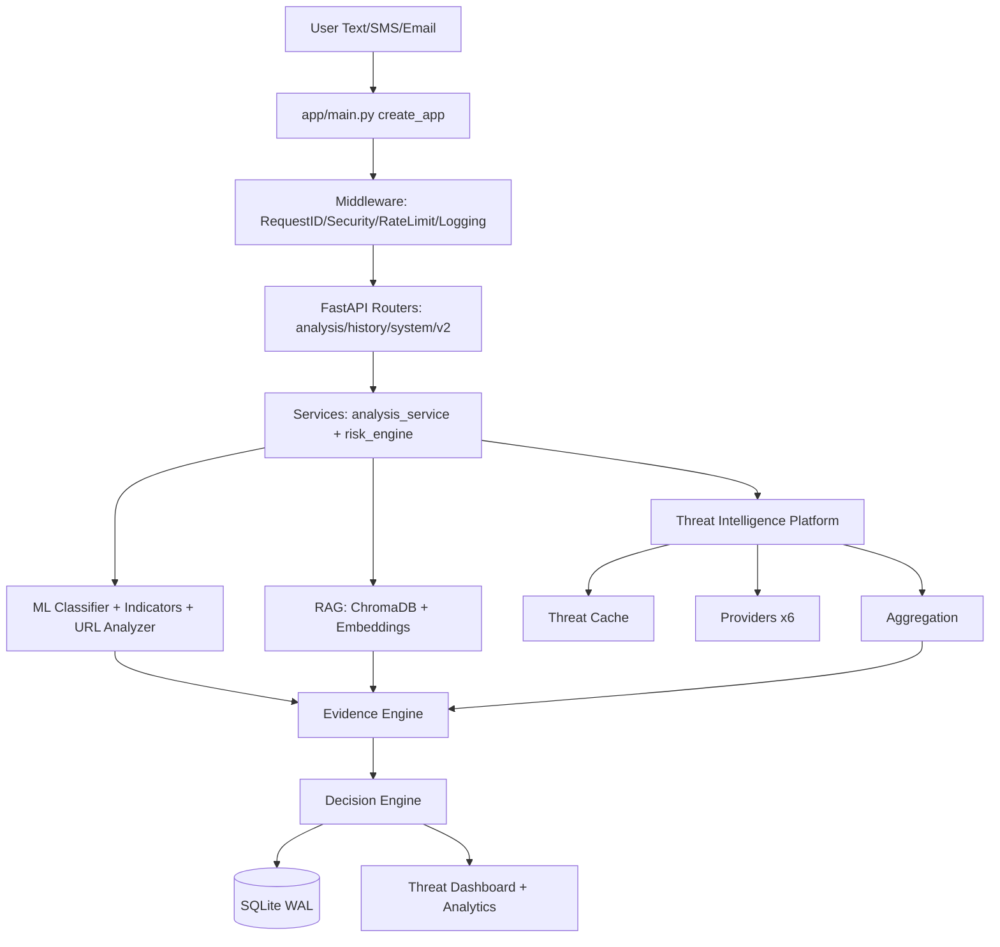
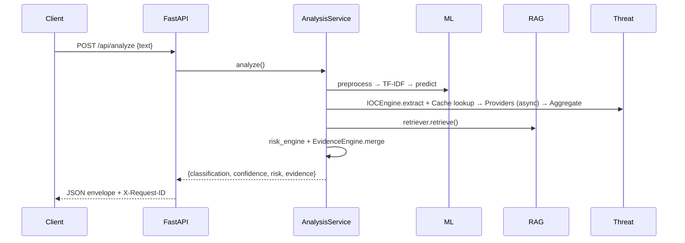
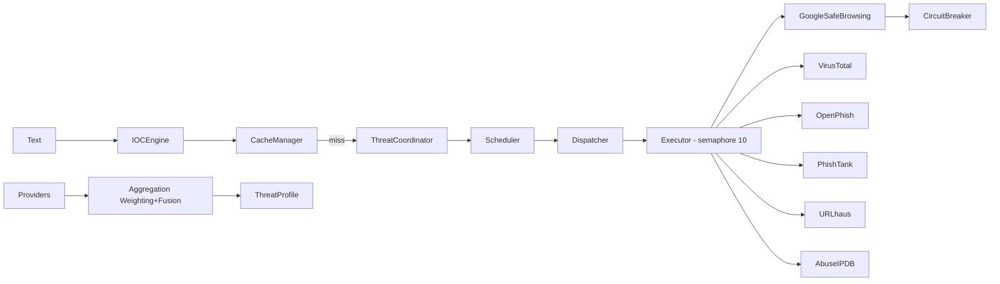
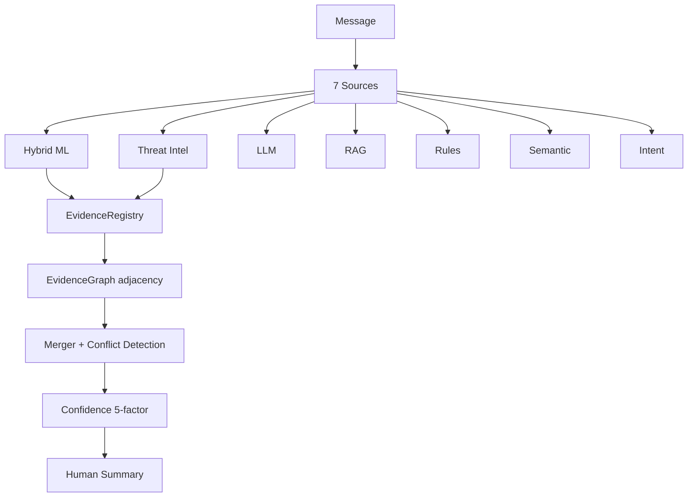
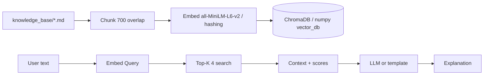
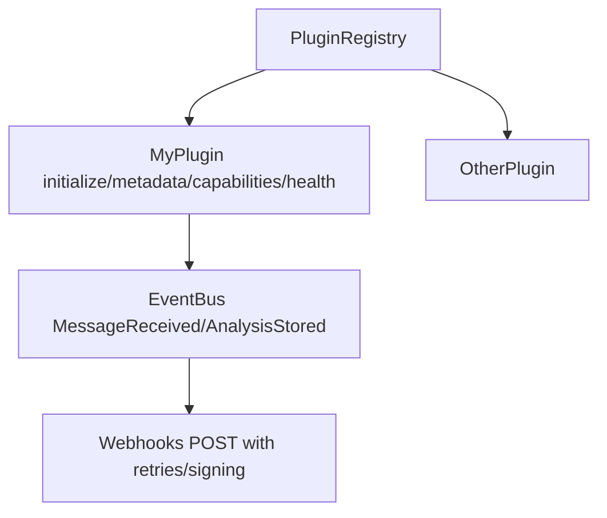
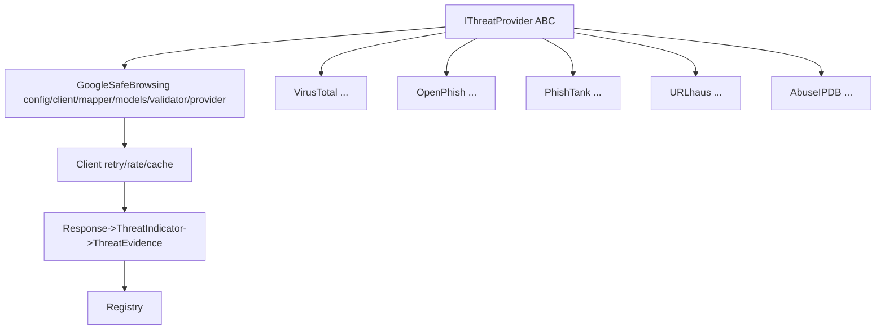
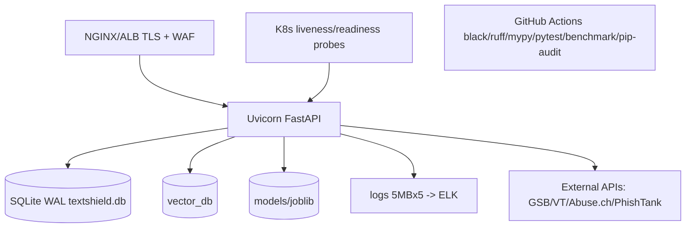

# Architecture Diagrams — TextShield v2.2

All diagrams use Mermaid (rendered on GitHub / `docsify`).

## Overall Architecture

## Request Flow

## Threat Intelligence Flow

## Evidence Flow

## RAG Pipeline

## Plugin Architecture

## Provider Architecture

## Deployment Diagram

