# TextShield V2.0 — System Design Document (SDD)

**Project Title:** TextShield — AI-Powered Semantic Message Intelligence System Using Retrieval-Augmented Generation (RAG) and Explainable AI

| Field | Value |
|---|---|
| Document Version | 2.0 |
| Status | Blueprint for implementation phases |
| Audience | Engineering, ML/NLP research, QA, Security, Technical Documentation |
| Predecessor | Product Requirements Document (PRD) — `docs/PRD.md` |
| Companion docs | `docs/architecture.md`, `docs/ml_pipeline.md`, `docs/rag_pipeline.md`, `docs/api.md`, `docs/setup.md` |

> **Scope of this document.** This SDD explains *how* the TextShield system is designed and built. It documents both the subsystems that already exist (from the V1.0 foundation) and the design targets introduced by the PRD (intent analysis, five-level risk scale, CRITICAL/UNCERTAIN semantics). Implementation of any new piece described here is governed by the requirements in the PRD.

---

# 1. System Overview

TextShield is a local-first, web-based semantic message intelligence system. A user pastes an SMS, a structured email, or a raw email (with headers); the system parses the input, extracts meaning and intent, applies a trained ML classifier, evaluates behavioral indicators, analyzes URLs statically, retrieves cited cybersecurity knowledge from a local vector store (RAG), computes a transparent risk verdict, and returns an explainable decision — classification, confidence, risk level, evidence, and a recommended action.

## 1.1 Subsystem map

| Subsystem | Package | Role |
|---|---|---|
| Web frontend | `app/templates/`, `static/` | Server-rendered pages (Jinja2) + vanilla JS + local CSS; no CDNs |
| API layer | `app/api/` | FastAPI routers: analysis, history, stats, model-info, health, knowledge base |
| Orchestration service | `app/services/analysis_service.py` | Runs the full analysis pipeline; single entry point for verdicts |
| Decision engine | `app/services/risk_engine.py` | Combines all signals into a 0–100 score and a five-level risk verdict |
| Semantic engine | `app/ml/` | Preprocessing, classifier, indicators, intent, URL analysis, input detection |
| RAG engine | `app/rag/` | Embeddings, vector store, retriever, LLM provider, explanation generator |
| Persistence | `app/database/` | SQLite access layer for history + statistics |
| Schemas | `app/schemas/` | Pydantic request/response models (validation contract) |
| Cross-cutting | `app/core/` | Configuration (`config.py`) and structured logging (`logging.py`) |

## 1.2 How subsystems interact

1. The **frontend** (browser) or an **API client** submits an `AnalyzeRequest` JSON to `POST /api/analyze`.
2. The **API layer** validates the payload with the **schemas** (Pydantic); invalid input yields 422.
3. The **orchestration service** executes the pipeline: input parsing and auto-detection → normalization/redaction → entity extraction → ML classification → indicator engine → intent engine → URL analysis → RAG retrieval → risk computation → explanation generation → history persistence.
4. The **semantic engine** provides the ML verdict and structured evidence; the **RAG engine** provides grounded knowledge; the **decision engine** merges everything into the final risk decision.
5. The **persistence layer** stores a hashed history record (SQLite) after the analysis; failures there never break the response.
6. The response is validated against `AnalysisResult` and returned to the caller; the frontend renders classification, confidence, risk score/level, intent, indicators, URL findings, RAG evidence, explanation, and recommendation.

## 1.3 Overall workflow (message → decision)

```
message in ──► parse/auto-detect ──► normalize/redact ──► classify (ML)
   ──► indicators ──► intent ──► URLs ──► RAG retrieval ──► risk engine
   ──► explanation generator ──► structured verdict out
```

A single, deterministic orchestration function (`analyze()`) owns this flow, so API, web UI, and tests always exercise the same pipeline.

---

# 2. Architectural Style

TextShield follows a **modular, layered, dependency-injected-by-construction** architecture: a thin API layer over a service layer over domain modules, with cross-cutting configuration and logging. This is an evolutionary step toward clean/hexagonal architecture without the ceremony.

## 2.1 Separation of concerns

Each concern lives in exactly one package: HTTP (`app/api`), business flow (`app/services`), domain algorithms (`app/ml`, `app/rag`), persistence (`app/database`), contracts (`app/schemas`), and configuration (`app/core`). Routes never contain analysis logic; services never speak HTTP; domain modules never import FastAPI or the database.

## 2.2 Loose coupling

- The ML classifier, indicator engine, intent engine, and URL analyzer are **independent modules** with stable function signatures; the orchestrator composes them.
- The **VectorStore** and **EmbeddingProvider** are abstract interfaces with pluggable backends (chromadb/numpy; sentence-transformers/hashing), so swapping a backend requires no caller changes.
- The **LLM provider** is an abstraction (`LLMClient`) over Ollama and OpenAI-compatible endpoints; the generator depends only on the interface.
- `analysis_service` depends on interfaces and module functions, not on concrete route classes.

## 2.3 High cohesion

Every module has one clear responsibility: `risk_engine` computes risk only, `retriever` retrieves only, `generator` explains only, `intent` extracts sender intent only. Cohesive modules are independently testable — each has a dedicated test file.

## 2.4 Extensibility

New indicators = one rule dict; new intent class = one pattern block; new LLM provider = one `LLMClient` subclass; new embedding provider = one `EmbeddingProvider` subclass; new knowledge category = one directory in `knowledge_base/`. No orchestration changes are required.

## 2.5 Scalability

The design scales in three planes:
- **Vertical (local):** the synchronous pipeline with a thread-safe SQLite access layer and a TTL-cached RAG status supports many concurrent local analyses.
- **Horizontal (future):** the stateless API/service split means the app can be replicated behind a load balancer; SQLite → PostgreSQL and local vector store → distributed store are documented swaps (Section 19).
- **Data:** RAG retrieval is bounded by top-k; the index grows by chunk count without architectural change.

## 2.6 Maintainability

- Single-command test suite (`pytest`), compile-check (`compileall`), and documented scripts for every lifecycle operation.
- Structured logging with component context in every module.
- Configuration centralized in `app/core/config.py`; all tunables (risk weights, thresholds, top-k, limits) are constants, not magic numbers.
- Documentation lives beside the code (`docs/`), and architecture diagrams in this SDD mirror the real module map.

---

# 3. High-Level Architecture Diagram

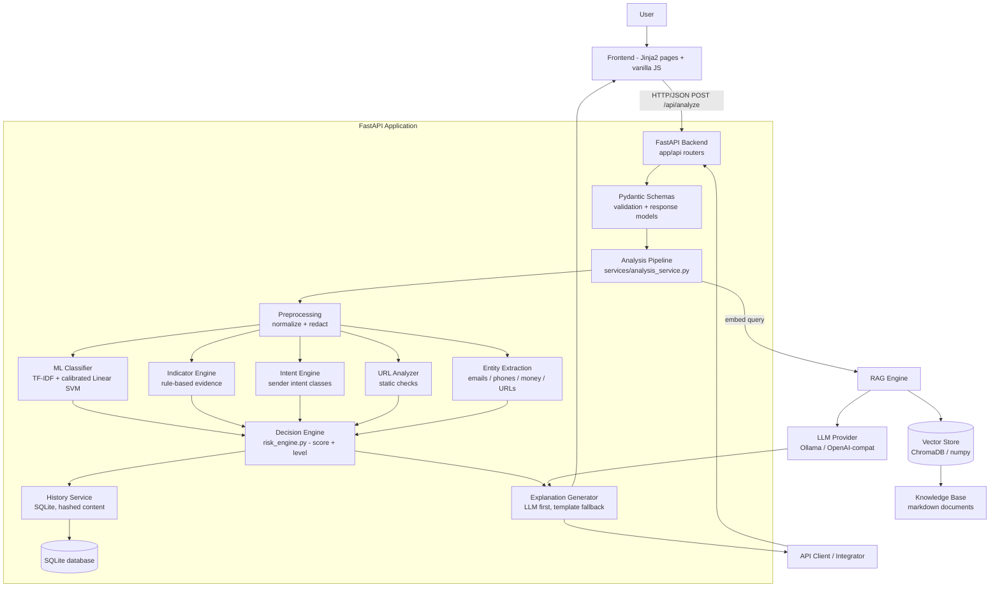

---

# 4. Complete Data Flow

The following stages execute in strict order inside `analysis_service.analyze()`. Stages are separated into *preparation*, *evidence*, *decision*, and *output* groups.

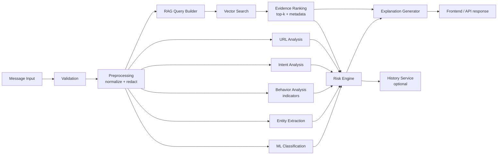

## 4.1 Stage-by-stage description

| # | Stage | What happens | Producer → Consumer |
|---|---|---|---|
| 1 | **Message input** | User provides `message` (SMS/TEXT), email fields (`subject`/`sender`/`body`), or `email_raw`; `input_type` may be `sms`, `text`, or `email`. | Frontend/API → route |
| 2 | **Validation** | Pydantic enforces types, length limits (`MAX_MESSAGE_LENGTH`), and content presence. Raw email pasted into the TEXT box is auto-detected (`looks_like_raw_email`) and upgraded to email analysis; `parse_raw_email` extracts subject/sender/body via the stdlib `email` package. Empty content → 422. | Route → service |
| 3 | **Preprocessing** | `normalize_text` lowercases, canonicalizes whitespace, and replaces phones/emails/URLs/money amounts with placeholders (`[PHONE]`, `[EMAIL]`, `[URL]`, `[MONEY]`). The classifier consumes the normalized text; placeholders preserve presence signals. | Service → ML |
| 4 | **Entity extraction** | `extract_emails` / `extract_phones` / `extract_urls` collect structured entities; the values feed URL analysis and indicator evidence, while placeholders protect privacy. | Service → evidence pool |
| 5 | **ML classification** | TF-IDF features (1–2 grams, `min_df=2`) → calibrated classifier → label + probability. `ClassifierUnavailableError` → HTTP 503 with actionable guidance. | ML → decision engine |
| 6 | **Behavior analysis** | `detect_indicators` runs 15+ rule groups (urgency, credentials, OTP, payment, job, investment, loan, delivery, phishing language, banking, promotion, financial) plus structural checks (ALL-CAPS, exclamations, link/contact presence); each result carries `indicator`, `severity`, `category`, `evidence` snippet. | ML → evidence pool |
| 7 | **Intent analysis** | `detect_intent` assigns one of 8 classes (credential_request, money_transfer, download_install, personal_data, prize_claim, confirmation_request, engagement, other) with description + matched evidence; dangerous classes are ordered first so the most dangerous intent wins. | ML → evidence pool |
| 8 | **URL analysis** | `analyze_urls` statically inspects each URL (scheme, host entropy, suspicious TLDs, IP-literal hosts, shorteners, look-alike domains). For email input, the sender domain is analyzed and merged into indicators/URLs. No network requests are made. | ML → evidence pool |
| 9 | **RAG query builder** | If the store is ready, the normalized message is embedded with the active provider; otherwise the stage is skipped and the response reports `rag_status.ready=false`. | Service → RAG |
| 10 | **Vector search** | Top-k nearest chunks are retrieved by cosine similarity (chromadb or numpy backend), each hit carrying `id`, `document`, `category`, `source`, `score`. | RAG → evidence |
| 11 | **Evidence ranking** | Hits are ordered by similarity; top-k (default 4) become the cited evidence list. Ranked evidence, not raw store state, enters the decision. | RAG → decision engine |
| 12 | **Decision engine** | `compute_risk` merges classification, confidence, indicator severities, intent, URL warnings, and high-risk RAG categories into a 0–100 score and a level (LOW/MEDIUM/HIGH/CRITICAL/UNCERTAIN) with an explicit factor list (Section 15). | Evidence → risk |
| 13 | **Explanation generator** | Structured prompt (message, classification, indicators, URLs, RAG evidence, risk, intent) → LLM if configured (JSON output, grounded constraints) → otherwise deterministic template. Both paths always produce explanation + recommendation + source label. | Risk → explanation |
| 14 | **History storage** | Optional (default on): one SQLite row with timestamp, input type, SHA-256 content hash, classification, confidence, risk level, optional truncated preview. Failures are logged and isolated — they never alter the verdict. | Service → database |
| 15 | **Output** | Response validated against `AnalysisResult` (classification, confidence, risk_score, risk_level, message_type, intent, indicators, urls, rag_evidence, explanation, explanation_source, recommended_action, risk_factors, model_used, rag_status, disclaimer) and rendered/returned. | Service → frontend |

---

# 5. Component Diagram

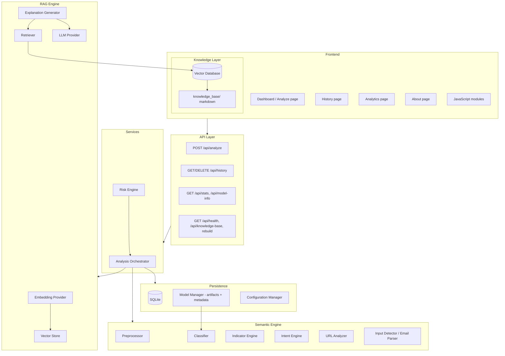

## 5.1 Component responsibilities

| Component | Responsibility |
|---|---|
| **Frontend** | Render pages, collect input, call APIs, display verdicts and evidence; no business logic |
| **Backend (FastAPI)** | Route HTTP to services, validate payloads, shape responses, centralize error mapping |
| **Semantic Engine** | Preprocess, classify, extract entities, detect indicators and intent, analyze URLs |
| **Intent Engine** | Assign sender-intent classes with evidence (V2.0) |
| **Behavior Engine** | Rule-based behavior analysis with severity/category evidence |
| **Embedding Engine** | Message/document embedding (sentence-transformers, hashing fallback) |
| **RAG Engine** | Retrieval orchestration: embed query, search, rank, prepare evidence |
| **Knowledge Base** | Curated markdown documents organized by category |
| **Vector Database** | Embedding + metadata persistence with similarity search (chromadb / numpy) |
| **Decision Engine** | Merges all signals into score + level + factors |
| **History Service** | SQLite CRUD for analysis records and statistics |
| **Analytics Service** | Aggregates history into dashboard metrics |
| **Model Manager** | Loads artifacts, exposes metadata (algorithm, training date, metrics) |
| **Configuration Manager** | Environment-driven settings with defaults; `.env.example` contract |

---

# 6. Module Responsibilities

For every module: purpose, responsibilities, inputs, outputs, dependencies, and error handling.

## 6.1 `app/core/config.py`

- **Purpose:** Single source of runtime configuration.
- **Responsibilities:** Load `.env` via `python-dotenv`; expose typed settings (paths, limits, thresholds, providers); ensure runtime directories exist.
- **Inputs:** Environment variables (documented in `.env.example`).
- **Outputs:** `settings` singleton with typed attributes.
- **Dependencies:** `dotenv`, `pathlib`, `os`.
- **Error handling:** Invalid integers fall back to defaults (`_get_int`); missing values use documented defaults; no hard failures at import.

## 6.2 `app/core/logging.py`

- **Purpose:** Consistent structured logging with component context.
- **Responsibilities:** Configure levels/formats; provide `get_logger(module)`.
- **Inputs:** Module names.
- **Outputs:** Loggers.
- **Dependencies:** stdlib `logging`.
- **Error handling:** Logging never raises in production paths.

## 6.3 `app/schemas/analysis.py`

- **Purpose:** API contract and validation boundary.
- **Responsibilities:** Model `AnalyzeRequest` (with cross-field content validator), `AnalysisResult`, history/stats/health/KB response models.
- **Inputs:** Raw request JSON.
- **Outputs:** Validated Pydantic models (422 on failure).
- **Dependencies:** `pydantic`, `settings`.
- **Error handling:** `ValidationError` → FastAPI 422 with field-level details; length limits enforced per field.

## 6.4 `app/ml/preprocess.py`

- **Purpose:** Deterministic normalization and sensitive-entity masking.
- **Responsibilities:** `normalize_text` (lowercase, whitespace, placeholders), `extract_emails/phones/urls`, optional `tokenize(remove_stopwords=False)` with a built-in stopword set.
- **Inputs:** Raw text.
- **Outputs:** Normalized text, entity lists, tokens.
- **Dependencies:** stdlib `re`.
- **Error handling:** Pure functions; empty/None inputs return safe empties.

## 6.5 `app/ml/features.py`

- **Purpose:** Feature construction shared by training and inference.
- **Responsibilities:** `prepare_corpus(texts, remove_stopwords=False)`, `build_tfidf_vectorizer()` (single source of truth for vectorizer parameters).
- **Inputs:** Raw text lists.
- **Outputs:** Cleaned corpus, configured `TfidfVectorizer`.
- **Dependencies:** `sklearn`, `preprocess`.
- **Error handling:** N/A (pure construction); runtime vectorizer errors propagate to the classifier layer.

## 6.6 `app/ml/classifier.py`

- **Purpose:** Load and run the trained model.
- **Responsibilities:** Load joblib artifacts (classifier + vectorizer + metadata) lazily; `predict(text)` → `Prediction(label, probability)`; expose `algorithm_name`.
- **Inputs:** Normalized text.
- **Outputs:** Label (`SPAM`/`HAM`) + calibrated probability; or `RuntimeError` when artifacts are missing/corrupt.
- **Dependencies:** `joblib`, `sklearn`, `config`.
- **Error handling:** Missing artifacts → `RuntimeError`; the service converts it to `ClassifierUnavailableError` → HTTP 503.

## 6.7 `app/ml/indicators.py`

- **Purpose:** Rule-based behavior evidence.
- **Responsibilities:** Run 15+ regex/lexical rules plus structural checks; return sorted indicator dicts `{indicator, severity, category, evidence}`; `count_severity`.
- **Inputs:** Raw text.
- **Outputs:** Indicator list (never empty list of failure).
- **Dependencies:** `re`, `preprocess` extractors.
- **Error handling:** Never fails; empty input → `[]`.

## 6.8 `app/ml/intent.py` (V2.0)

- **Purpose:** Sender intent extraction.
- **Responsibilities:** Assign one of 8 intent classes with description + matched evidence; `is_malicious_intent(label)`.
- **Inputs:** Raw text.
- **Outputs:** `{"label", "description", "evidence"}`.
- **Dependencies:** `re`.
- **Error handling:** Never fails; empty input → `other`.

## 6.9 `app/ml/url_analyzer.py`

- **Purpose:** Static URL and sender-domain risk analysis.
- **Responsibilities:** Extract and analyze URLs (scheme, host, TLD, IP literals, shorteners, look-alike brands, suspicious characters); `analyze_domain(host)` for sender domains.
- **Inputs:** Text or host string.
- **Outputs:** `[{url, host, scheme, warnings, flag_count, ...}]`.
- **Dependencies:** stdlib `re`, `urllib.parse`.
- **Error handling:** Never performs network I/O; malformed URLs are skipped safely.

## 6.10 `app/ml/input_detection.py`

- **Purpose:** Raw-email detection and parsing.
- **Responsibilities:** `looks_like_raw_email` (header-marker heuristic on first lines); `parse_raw_email` (stdlib `email` package → subject/sender/body, MIME-aware); `detect_input_type`.
- **Inputs:** Raw text.
- **Outputs:** Boolean / parsed dict / type string.
- **Dependencies:** stdlib `email`.
- **Error handling:** Malformed headers degrade to best-effort extraction; never raises into the pipeline.

## 6.11 `app/rag/embeddings.py`

- **Purpose:** Embedding abstraction.
- **Responsibilities:** `EmbeddingProvider` interface; `SentenceTransformerProvider` (e.g., `all-MiniLM-L6-v2`); `HashingEmbeddings` fallback (character n-gram hashing, 768-dim); `create_embedding_provider()`.
- **Inputs:** Text lists.
- **Outputs:** `np.ndarray` (n, dim).
- **Dependencies:** `sentence-transformers`, `numpy`.
- **Error handling:** Provider creation failure → hashing provider; embed failures logged and raised to retriever which returns empty evidence.

## 6.12 `app/rag/vector_store.py`

- **Purpose:** Local vector database abstraction.
- **Responsibilities:** `VectorStore` interface (`add`, `query`, `delete_all`, `count`, structure metadata); `ChromaStore` (persistent chromadb) and `SimpleVectorStore` (numpy + JSON) backends; `describe_store` reads `structure.json`.
- **Inputs:** Embeddings, documents, metadata, queries.
- **Outputs:** Hits `[{id, document, metadata, score}]`; structure dicts.
- **Dependencies:** `chromadb`, `numpy`, stdlib `json`.
- **Error handling:** Backend import/init failures → fallback store; query failures → `[]`.

## 6.13 `app/rag/retriever.py`

- **Purpose:** Retrieval orchestration.
- **Responsibilities:** Lazy store/provider initialization; `retrieve(text, top_k)` (embed → query → shape hits with source/category/score); `status()` with a 5-second TTL cache; `invalidate_cache()` after rebuild.
- **Inputs:** Text, top-k.
- **Outputs:** Evidence list (never fabricated) + status dict.
- **Dependencies:** `embeddings`, `vector_store`, `config`.
- **Error handling:** Not ready → `[]` + `ready=false`; cache prevents per-request disk reads.

## 6.14 `app/rag/llm.py`

- **Purpose:** LLM provider abstraction.
- **Responsibilities:** `LLMClient` interface; `OllamaClient` (`/api/generate`); `OpenAICompatClient` (`/chat/completions`, also covers NVIDIA NIM); `create_llm_client()` factory; `extract_json` for response parsing.
- **Inputs:** System + user prompts.
- **Outputs:** Completion text or `None`.
- **Dependencies:** `requests`, `config`.
- **Error handling:** Disabled/misconfigured → `None` (template mode); timeouts/HTTP errors → caught by generator → template fallback.

## 6.15 `app/rag/generator.py`

- **Purpose:** Explanation generation with provenance.
- **Responsibilities:** Build grounded prompt (message, classification, indicators, URLs, RAG evidence, risk, intent); call LLM; validate JSON; fall back to `template_explanation`; `_recommendation` maps level to action (incl. CRITICAL/UNCERTAIN-specific advice).
- **Inputs:** Analysis data dict.
- **Outputs:** `{"text", "summary", "recommendation", "source": "llm"|"template"}`.
- **Dependencies:** `llm`, `config`.
- **Error handling:** Any LLM failure → template; template is pure and deterministic.

## 6.16 `app/services/risk_engine.py`

- **Purpose:** Transparent decision scoring (Section 15).
- **Responsibilities:** `compute_risk(classification, confidence, indicators, urls, rag_evidence, intent)` → `{score, level, factors}`; enforce CRITICAL (malicious intent + corroboration) and UNCERTAIN (guessing, no evidence) rules.
- **Inputs:** Evidence from all stages.
- **Outputs:** Score (0–100), level, factor list.
- **Dependencies:** `config`, `ml.intent`.
- **Error handling:** Pure function; never raises on empty inputs.

## 6.17 `app/services/analysis_service.py`

- **Purpose:** Pipeline orchestrator.
- **Responsibilities:** `analyze(request, store_history=True)`: input handling → evidence stages → risk → explanation → mapping → history → result. `_store_history` isolates persistence. `ClassifierUnavailableError` definition.
- **Inputs:** `AnalyzeRequest`.
- **Outputs:** `AnalysisResult`-shaped dict.
- **Dependencies:** All modules above.
- **Error handling:** Empty content → `ValueError` → 422; classifier missing → 503; history failures logged only; unexpected exceptions propagate to route-level 500 mapping.

## 6.18 `app/api/*.py`

- **Purpose:** HTTP surface.
- **Responsibilities:** Map endpoints to services; translate exceptions to status codes; response models.
- **Dependencies:** FastAPI, schemas, services.
- **Error handling:** 422 validation, 503 unavailability, 500 internal (generic message, no stack traces).

## 6.19 `app/database/database.py`

- **Purpose:** SQLite persistence.
- **Responsibilities:** Schema creation (`analyses` table + indexes), thread-safe connections (`RLock` + per-call connections), `insert_analysis`, `query_history` (filtered/ordered/paginated), `delete_history_entry`, `clear_history`, `aggregate_stats`.
- **Inputs:** Record dicts / filters.
- **Outputs:** Rows, counts, stats.
- **Dependencies:** stdlib `sqlite3`, `config`.
- **Error handling:** All operations are guarded by the orchestrator; column allow-lists prevent SQL injection; init failures surface at startup.

## 6.20 `scripts/*.py`

- **Purpose:** Lifecycle tooling.
- **Responsibilities:** `prepare_dataset.py` (data placement/validation), `train_model.py` (candidate algorithms, selection, calibration, persistence + metadata), `evaluate_model.py` (metrics/confusion matrix/calibration report), `build_knowledge_base.py` (chunk, embed, index, structure metadata).
- **Dependencies:** `app` packages.
- **Error handling:** CLI-friendly messages; non-zero exit codes on failure.

---

# 7. Sequence Diagrams

## 7.1 Message analysis

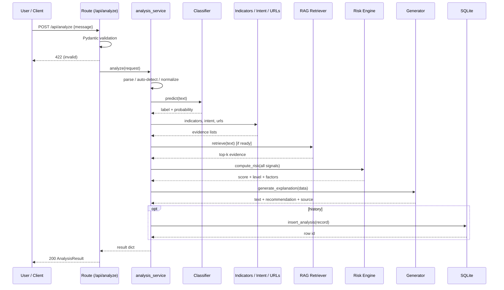

## 7.2 Knowledge retrieval

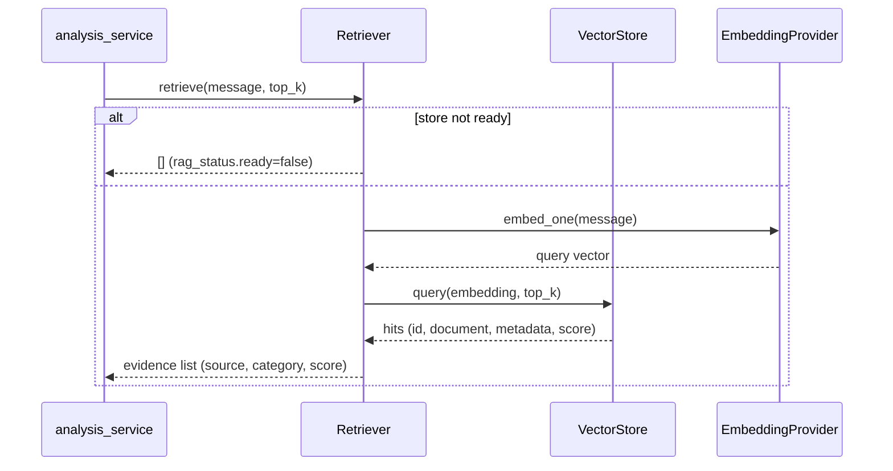

## 7.3 History storage

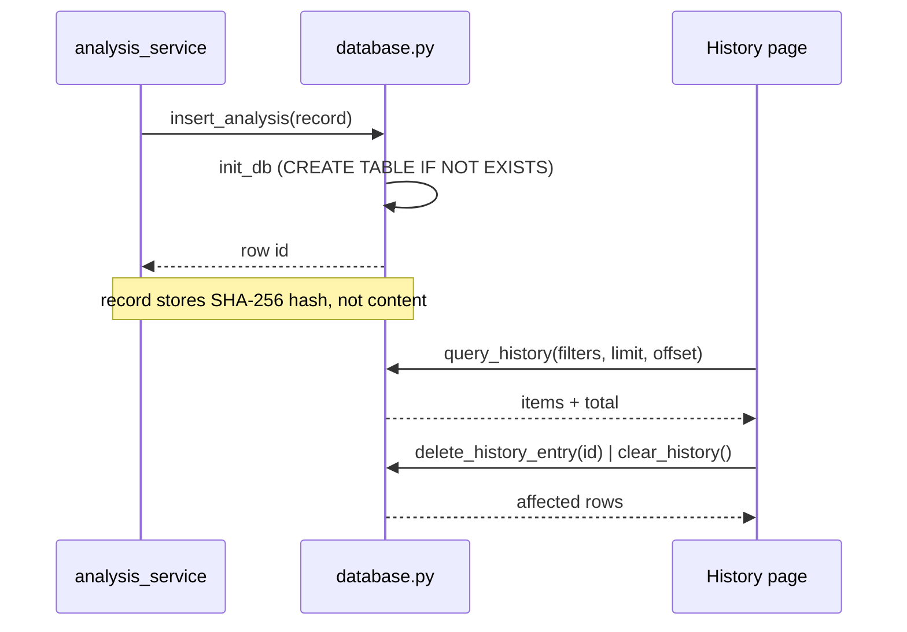

## 7.4 Analytics

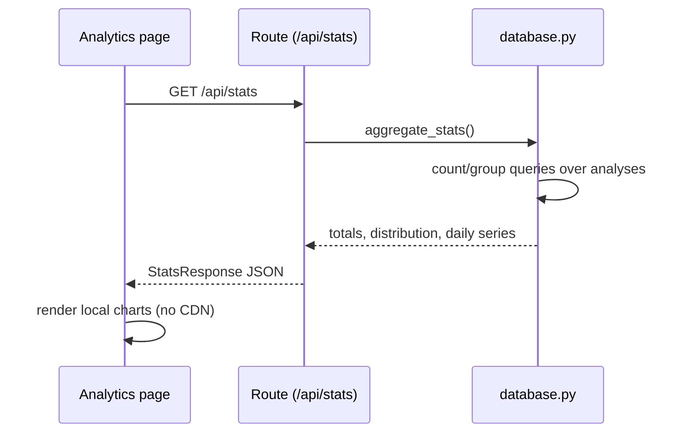

---

# 8. Backend Architecture

## 8.1 Layers

| Layer | Artifacts | Rules |
|---|---|---|
| **Controllers (routes)** | `app/api/routes_*.py` | Thin; validation + exception→HTTP mapping only |
| **Services** | `analysis_service.py`, `risk_engine.py` | Business flow and decisions; no HTTP, no schema imports beyond data shaping |
| **Core logic** | `app/ml/*` | Domain algorithms; pure functions; no I/O except artifact loading |
| **RAG pipeline** | `app/rag/*` | Retrieval + generation; provider abstractions |
| **Repository layer** | `app/database/*` | SQLite CRUD; data access only |
| **Configuration layer** | `app/core/config.py` | Environment settings; no logic beyond parsing |
| **Schema layer** | `app/schemas/*` | Contract; validation |

## 8.2 Controllers

- `routes_analysis.py` — `POST /api/analyze` (single endpoint).
- `routes_history.py` — `GET /api/history`, `DELETE /api/history/{id}`, `DELETE /api/history`.
- `routes_stats.py` — `GET /api/stats`, `GET /api/model-info`.
- `routes_health.py` — `GET /api/health`, `GET /api/knowledge-base`, `POST /api/knowledge-base/rebuild`.

## 8.3 Decision engine placement

The decision engine (`risk_engine.py`) is a service-layer pure function: it receives every evidence stream and returns the verdict. It is deliberately *not* part of the ML package (it consumes ML output) and *not* part of the RAG package (it consumes RAG output) — it is the composition point of the whole system.

## 8.4 ML pipeline

1. `scripts/prepare_dataset.py` validates the corpus (CSV with label/text columns, permissive license).
2. `scripts/train_model.py` cleans text, builds TF-IDF features, evaluates candidate algorithms (MultinomialNB, LogisticRegression, LinearSVC) with cross-validation, selects the best by weighted F1, wraps the winner in `CalibratedClassifierCV`, persists classifier + vectorizer (joblib) + `model_metadata.json`.
3. `scripts/evaluate_model.py` produces `evaluation_report.json` (accuracy, per-class precision/recall/F1, confusion matrix, calibration note).
4. Runtime: `classifier.py` lazily loads artifacts; missing → 503.

## 8.5 RAG pipeline

1. **Indexing:** `build_knowledge_base.py` reads `knowledge_base/**/*.md`, chunks on paragraph/sentence boundaries with overlap, embeds with the active provider, stores via the `VectorStore` backend, and persists `structure.json` (counts, categories, build time, chunk parameters).
2. **Retrieval:** `retriever.retrieve()` embeds the query and returns ranked top-k hits.
3. **Generation:** `generator.py` composes the grounded prompt and calls the LLM, with template fallback.

## 8.6 LLM integration

`create_llm_client()` returns `None` unless `LLM_PROVIDER` is set (`ollama` | `openai` | `nvidia`) *and* `LLM_MODEL` is non-empty. The generator treats `None`/failure as "use template". Keys come from `LLM_API_KEY` (environment only). `extract_json` tolerates markdown-wrapped JSON.

## 8.7 Repository layer

All SQLite access is isolated in `database.py`: schema DDL, thread-safety (`RLock` + per-call `sqlite3.connect`), parameterized queries, column allow-list for `ORDER BY`, and stateless connection handling.

## 8.8 Configuration layer

`settings` is a module-level singleton created at import; `ensure_directories()` creates runtime folders. Configuration is *read-only at runtime*; any mutation requires a restart (deliberate KISS choice).

---

# 9. Frontend Architecture

Server-rendered Jinja2 pages with a shared `base.html` (navigation, theme, footer), per-page vanilla JS, and a single local stylesheet. No frameworks, no CDNs — offline/LAN friendly and dependency-free.

| Screen | Template | JS | Data source |
|---|---|---|---|
| **Dashboard / Analyze** | `index.html` | `index.js` | `POST /api/analyze` |
| **History** | `history.html` | `history.js` | `GET/DELETE /api/history` |
| **Analytics** | `analytics.html` | `analytics.js` | `GET /api/stats`, `GET /api/model-info` |
| **Knowledge Base** | `knowledge_base.html` | `kb.js` | `GET /api/knowledge-base`, rebuild POST |
| **About** | `about.html` | `about.js` | `GET /api/health`, static content |

## 9.1 Dashboard / Analysis screen

Tabs for SMS / TEXT / EMAIL (structured fields + optional raw email). Submits JSON to `/api/analyze`; renders: classification + confidence + risk hero boxes, sender intent card, indicators list (severity chips), URL findings, RAG evidence (source/category/similarity), recommendation box, disclaimer, and explanation provenance. Errors render inline.

## 9.2 History screen

List with verdict/risk badges, timestamps, optional redacted previews; filters (input type, classification, risk level), pagination, per-row delete, clear-all with confirmation, and summary totals.

## 9.3 Analytics screen

Local canvas charts: volume over time, verdict mix, risk distribution, indicator frequency; model information panel (algorithm, training date, metrics). All rendering is client-side from `/api/stats` and `/api/model-info`.

## 9.4 Knowledge Base screen

Category listing with document counts; document browsing; rebuild action with progress/result status (`POST /api/knowledge-base/rebuild`).

## 9.5 Model Information screen

Presented within the About page: model availability, algorithm, training date, dataset summary, metrics, and comparison table from `/api/model-info`; plus health status (`/api/health`) and the privacy statement.

## 9.6 Settings screen (design target)

V2.0 configuration is environment-driven by design (KISS, no admin surface). A settings screen is a **planned** future addition: read-only display of effective configuration and, later, persisted user preferences (preview storage opt-in, default input type, theme). For now the privacy controls (preview opt-in) live in configuration, and the About page documents the privacy model.

---

# 10. Database Design

Persistence is SQLite via the stdlib `sqlite3` module. Thread-safety: a process-wide `RLock` plus short-lived connections per operation.

## 10.1 Current schema — `analyses` (History)

```sql
CREATE TABLE IF NOT EXISTS analyses (
    id            INTEGER PRIMARY KEY AUTOINCREMENT,
    timestamp     TEXT    NOT NULL,      -- ISO-8601 UTC
    input_type    TEXT    NOT NULL,      -- sms | text | email
    message_hash  TEXT    NOT NULL,      -- SHA-256 of content (privacy)
    classification TEXT  NOT NULL,       -- SPAM | HAM
    confidence    REAL    NOT NULL,      -- calibrated probability
    risk_level    TEXT    NOT NULL,      -- LOW|MEDIUM|HIGH|CRITICAL|UNCERTAIN
    preview       TEXT                   -- optional truncated redacted preview
);
CREATE INDEX idx_analyses_timestamp      ON analyses(timestamp);
CREATE INDEX idx_analyses_classification ON analyses(classification);
```

**Analytics** are derived: `aggregate_stats()` computes totals, distributions, and the 14-day series with aggregate queries — no separate table (KISS, always-consistent).

## 10.2 ER diagram

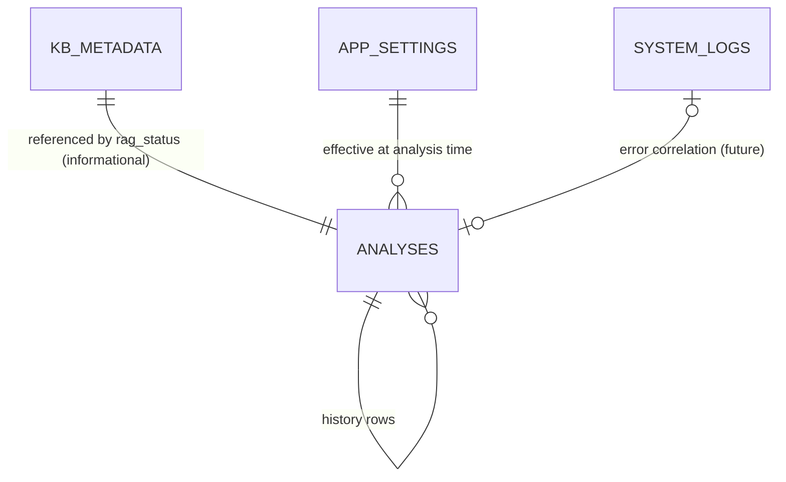

## 10.3 Planned schema extensions (future phases)

| Table | Purpose | Key columns | Relationships |
|---|---|---|---|
| `kb_metadata` | Cache of `structure.json` for UI/API without disk reads | `id`, `built_at`, `chunk_count`, `document_count`, `categories`, `embedding_provider` | 1:1 with the current index; referenced by `rag_status` |
| `app_settings` | Runtime-tunable preferences (future settings screen) | `key` PK, `value`, `updated_at` | Read by services at startup; documented defaults |
| `system_logs` | Persistent error/audit trail (future) | `id`, `ts`, `level`, `module`, `message` | Correlated with analyses by timestamp/message_hash |
| `analyses.intent` (column) | V2.0 intent label on history rows (optional) | `intent` TEXT | Enables intent-frequency analytics |

Relationships: history is the hub; settings and logs are auxiliary; KB metadata is a snapshot of the vector store, not a relational dependency.

---

# 11. Knowledge Base Architecture

## 11.1 Directory structure

```
knowledge_base/
├── banking_scams/          # account-blocked, fake payment, KYC
├── email_scams/            # invoice, account verification
├── sms_scams/              # OTP, delivery, lottery/prize
├── job_scams/              # work-from-home, recruitment
├── loan_scams/             # advance-fee, instant loans
├── investment_scams/       # crypto, guaranteed returns
├── phishing/               # brand impersonation, credential phishing
├── spam_patterns/          # urgency, promotional, URL tactics, social engineering
├── safety_guidelines/      # safe URL checking, what to do if scammed
├── examples/               # annotated spam and ham examples
└── reference/              # glossary, risk-level definitions
```

## 11.2 Document format and metadata

- **Format:** Markdown, one topic per file, human-readable headings.
- **Metadata:** category = parent directory name; topic = filename stem; chunk IDs encode `category:stem:index`. The index stores per-chunk `source`, `category`, and optionally `is_example` flags so every retrieved chunk is traceable.

## 11.3 Versioning and update process

- **Version stamping:** `structure.json` records `built_at` and chunk/document counts; staleness is detectable by status.
- **Update flow:** edit/add documents → run `scripts/build_knowledge_base.py` (or UI rebuild) → store re-ingests, re-embeds, replaces index, writes structure metadata, and the retriever cache is invalidated.
- **Governance:** content is reviewed for accuracy and non-harm (safety guidance never instructs clicking/reply); categories follow PRD Section 18.

---

# 12. Vector Database Design

## 12.1 Embedding storage

- Provider: sentence-transformers (default `all-MiniLM-L6-v2`, 384-dim, CPU) or the deterministic hashing fallback (768-dim).
- Storage: `VectorStore` interface with two backends:
  - **ChromaStore** — persistent chromadb collection (`vector_db/`), HNSW-style ANN search.
  - **SimpleVectorStore** — numpy matrix + JSON metadata (zero dependencies).
- Structure metadata persists in `vector_db/structure.json`.

## 12.2 Metadata storage

Per chunk: `{category, source (filename), is_example, index}` — stored as collection metadata (chromadb) or JSON sidecar (simple store). Retrieved hits carry the same metadata to the UI.

## 12.3 Chunking strategy

`chunk_text(text, size, overlap)` splits on paragraph boundaries, then sentence boundaries, keeping deterministic size and overlap so semantic units stay intact and the chunker is reproducible across rebuilds.

## 12.4 Retrieval strategy

`retriever.retrieve(text, top_k)`:
1. Embed the normalized message with the same provider used at build time (consistency requirement).
2. Query the store with cosine similarity, top-k (default 4).
3. Return hits shaped as `{source, category, score, document, is_example}` — never fabricated.

## 12.5 Similarity search

Cosine similarity over dense vectors; the chromadb backend handles ANN search; the simple store performs exact dot-product search on the normalized matrix (correct and adequate at KB scale). Results are ranked by score descending; ranking is exposed so evidence ordering is auditable.

---

# 13. AI Architecture

| Component | Design |
|---|---|
| **Semantic Understanding Engine** | Combination of normalized-text features (placeholders preserve entity presence) + dense embeddings + structured indicator/intent evidence. Meaning-level consistency comes from embeddings (paraphrase tolerance) and from the rule engines' evidence mapping. |
| **Intent Detection** | `ml/intent.py`: 8 classes, ordered rules (dangerous first), evidence snippets. Machine-readable label in every response (AI-02). |
| **Behavior Analysis** | `ml/indicators.py`: severity/category/evidence tuples; structural checks (ALL-CAPS, exclamations, presence signals). |
| **Entity Extraction** | Regex-based extractors for emails, phones, URLs, money; values feed evidence while placeholders protect privacy. |
| **Confidence Estimation** | `CalibratedClassifierCV` over the selected algorithm; probability exposed as confidence; calibration quality reported in evaluation. |
| **Risk Assessment** | `risk_engine.py`: documented weights and thresholds; five levels; per-verdict factor list (RZ-01/02/05). |
| **Decision Engine** | Deterministic composition of every signal (Section 15); never LLM-determined. |
| **Explainability Engine** | `generator.py`: template guarantees the six explanation components; LLM path constrained to retrieved evidence + findings; provenance labeled (`template`/`llm`). |
| **Evidence Validation** | Retrieval returns only real chunks (source + category + text); LLM output is post-validated (JSON extraction, fallback on garbage); explanations cite only presented evidence (EX-07). |

---

# 14. RAG Architecture

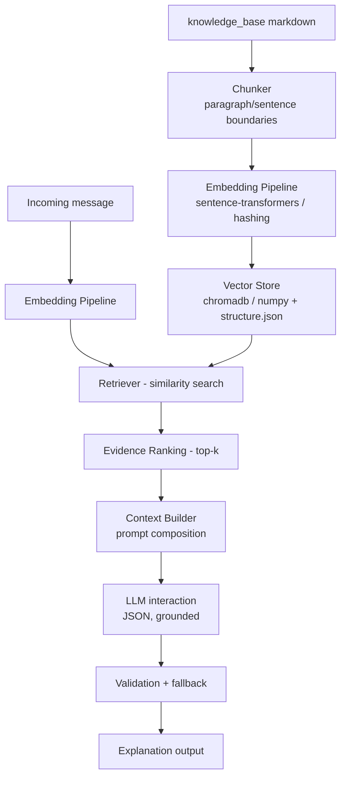

## 14.1 Indexing pipeline

`build_knowledge_base.py`: discover docs by category → chunk → embed → add to store → persist structure metadata. Idempotent; rebuild replaces the index wholesale.

## 14.2 Embedding pipeline

One provider abstraction used at build *and* query time (consistent vector space). Batched embedding at build; single-query embedding at inference.

## 14.3 Retrieval pipeline

Retriever checks readiness (cached 5 s), embeds the query, runs top-k search, shapes evidence. Not ready → `[]` with `ready=false` (graceful degradation).

## 14.4 Context builder

`generator._user_prompt` composes: original message (truncated), ML classification + confidence, indicators (top 8), URL findings, RAG evidence (top 4), risk level, message type, sender intent. The system prompt forbids changing the classification and demands JSON output.

## 14.5 Evidence ranking

Retrieval order (score desc, top-k) is the ranking; the top hit names the dominant retrieved family in template explanations.

## 14.6 LLM interaction

`llm.complete(system, user)` with temperature 0.2, non-streaming, timeout-bounded. Response parsed by `extract_json`; any failure → template. LLM output never influences the verdict — only the explanation.

---

# 15. Decision Engine Design

## 15.1 Inputs

| Input | Source | Role |
|---|---|---|
| ML signal | classifier (label + probability) | Primary verdict + confidence |
| Semantic analysis | normalized text/embeddings | Feature space; retrieval query |
| Intent | `ml/intent.py` | Escalation signal (malicious intent adds score; CRITICAL requires it) |
| Entities | extractors | URL analysis input; evidence |
| Behavior | indicators | Severity-weighted score additions |
| Retrieved evidence | RAG | High-risk category bonus; explanation grounding |
| URL risk | url_analyzer | Flag-weighted score additions |
| LLM reasoning | generator | *Never* an input to the score — explanation only |

## 15.2 Computation

```
score = base(SPAM=50 | HAM=5)
      + Σ indicator weights (high 12 / medium 7 / low 3)
      + malicious-intent bonus (12)
      + URL flag bonuses (IP 10 / suspicious TLD 6 / shortener 4)
      + confidence adjustment (SPAM≥0.8 → +15; weak HAM → +10)
      + RAG high-risk-category bonus (8, once)
clamp(0..100) → level via thresholds (30/60); SPAM floor = MEDIUM
```

## 15.3 Outputs

| Output | Meaning |
|---|---|
| `classification` | SPAM / HAM (from ML, never overridden) |
| `risk_level` | LOW / MEDIUM / HIGH / CRITICAL / UNCERTAIN |
| `confidence` | Calibrated ML probability |
| `recommendation` | Level- and evidence-specific action (generator) |
| `evidence` | Indicators, URLs, RAG hits, factors — all exposed |
| `risk_factors` | Human-readable list justifying the level |

## 15.4 Special rules (PRD RZ-03/RZ-04)

- **CRITICAL** = SPAM + malicious intent (credential/money/download) + confidence ≥ 0.85 + score ≥ 80 + (high-severity indicator **or** flagged URL). Never granted on weak evidence.
- **UNCERTAIN** = confidence < 0.5 + LOW-level score + no malicious intent + no indicators + no flagged URLs. Never masquerades as a confident verdict.

## 15.5 Why the LLM never makes the final decision

1. **Determinism and testability:** the score/level is a pure function of evidence — identical inputs yield identical verdicts; rules are unit-testable.
2. **Verifiability:** a documented formula can be audited and explained; a sampled LLM verdict cannot be re-derived.
3. **Reliability:** the LLM may be absent (offline/template mode); the decision must not depend on it.
4. **Safety:** LLMs can hallucinate severity; the verdict stays grounded in ML + rules + evidence.
5. **Prompt-injection isolation:** even a hostile message that tricks the LLM cannot change the verdict, because the verdict path never consumes LLM output.
6. **Cost/latency:** decisions are computed in milliseconds; LLM time is spent only on the explanation.

---

# 16. Security Architecture

| Concern | Design |
|---|---|
| **Input validation** | Pydantic: types, field lengths (`MAX_MESSAGE_LENGTH`), cross-field content validator; oversized payloads rejected (422). No user input reaches code paths beyond string processing. |
| **Prompt injection mitigation** | (a) The LLM is instructed to explain, never override, and to output JSON; (b) the verdict path never consumes LLM output — injection cannot change the decision; (c) system/user prompt framing treats the message as data; (d) template mode is immune by construction; (e) `LLM_TEMPERATURE=0.2` reduces creativity drift. |
| **Data privacy** | Content redaction before storage (placeholders); SHA-256 hashing by default; previews truncated + redacted only when `HISTORY_STORE_PREVIEW=true`; local-only embedding/retrieval; no third-party transmission by default. |
| **Configuration security** | All secrets via environment variables; `.env` excluded from VCS (`.gitignore`); no secrets in code; `LLM_API_KEY` never logged. |
| **Secret management** | Provider keys read at client-creation time; startup warnings on missing models; documented `.env.example`. |
| **Safe URL handling** | URL analysis is **static only** — no fetching, no DNS queries, no SSRF surface; malformed URLs skipped. |
| **Hallucination mitigation** | Grounded generation: LLM prompt includes only retrieved evidence + findings; template fallback; JSON validation; provenance labeling. |
| **Evidence validation** | Retriever returns only stored chunks with source/category; evidence is never synthesized; scores exposed for audit. |
| **Output encoding** | All user-derived content rendered in templates is HTML-escaped client-side (`escapeHtml` in JS) to prevent stored XSS; server templates escape by default (Jinja2). |
| **Hosting posture** | Default bind `127.0.0.1`; LAN exposure requires explicit configuration documented in setup guide. |
| **Error handling hygiene** | 500s return generic messages; stack traces stay in server logs. |

---

# 17. Error Handling Strategy

| Failure | Detection | Behavior | User-visible result |
|---|---|---|---|
| **LLM unavailable** | `create_llm_client()` → `None`; request timeout/HTTP error | Generator catches; template engine used | Explanation present, `explanation_source="template"` |
| **Vector DB unavailable** | Store init/query failure; structure missing | Retriever returns `[]`; status cached as not-ready | Analysis complete, `rag_status.ready=false`, no evidence section |
| **Knowledge base unavailable/missing docs** | Zero documents at build | Build reports counts; status shows ready=false | KB page shows empty state; analyze proceeds |
| **Database unavailable** | `insert_analysis`/init failure | Caught in `_store_history`; logged | Analysis succeeds; history not stored (logged) |
| **Malformed input** | Pydantic/ValueError | 422 with field detail | Clear validation message |
| **Large messages** | Length limits at schema level | 422 | "too long" message; documented limit |
| **Model artifacts missing/corrupt** | Load failure | `ClassifierUnavailableError` → 503 | "Run `python scripts/train_model.py`" guidance |
| **Embedding provider failure** | Provider creation failure | Hashing fallback | Analysis continues (lower semantic quality) |
| **LLM garbage output** | `extract_json` fails/schema-invalid | Fallback to template | Template explanation, labeled |
| **Timeouts** | `LLM_TIMEOUT_SECONDS`, requests exceptions | Same as LLM unavailable | Template explanation |
| **Unknown internal errors** | Uncaught exception | Route-level handler; logged with context | 500 "Internal analysis error" (no stack trace) |
| **History deletion of missing id** | `rowcount == 0` | Returns 404 | Clear message |

**Design rule:** every optional layer (RAG, LLM, embedding, history) degrades independently; the only hard dependencies are the classifier (explicit 503) and the explanation surface (always produced).

---

# 18. Performance Considerations

| Topic | Design |
|---|---|
| **Caching** | RAG status TTL-cached (5 s) — no `structure.json` disk read per analysis; invalidated on rebuild. Model/vectorizer loaded once (lazy singleton). LLM client created once. |
| **Embedding reuse** | Build-time batched embedding; query-time single embedding; provider instance reused. |
| **Index rebuilding** | On-demand only (script/UI); rebuild replaces the index atomically (new collection/matrix) and re-writes structure metadata. |
| **Concurrent users** | Stateless analysis pipeline; thread-safe SQLite (RLock + per-call connections); chromadb handles concurrent reads. |
| **Memory usage** | Model + vectorizer loaded once (~100 MB); embeddings model ~90 MB (CPU); index size bounded by KB (hundreds of chunks). Document chunks truncated in API/UI payloads (e.g., 420 chars) to bound response size. |
| **Latency** | Budget: SMS analysis ≤ 5 s CPU-only (classifier ~ms, embedding ~50 ms, retrieval ≤ 500 ms, LLM up to 30 s *only* when configured — but that is the explanation path; the verdict itself is ready before the LLM finishes). Template mode is always fast. |
| **Payload limits** | Message 10 000 chars max; email raw 20 000; response evidence truncated — prevents unbounded work. |

---

# 19. Scalability

| Target | Path from current design |
|---|---|
| **Multiple LLMs** | Already supported via `LLMClient` providers (ollama/openai/nvidia); add provider classes + config, no architecture change. |
| **Cloud deployment** | Stateless API + services deploy behind a load balancer; SQLite volume mount or file sync for history; documented containerization (future phase). |
| **Microservices** | The module boundaries map directly: `api` (gateway), `services` (analysis), `ml` (classifier service), `rag` (retrieval service), `database` (store) — each could become a service without redesign; latency-sensitive retrieval should remain near the analysis service. |
| **PostgreSQL** | Repository layer isolates SQL: implement `database.py` against `psycopg` with the same function signatures; SQL is parameterized and schema-portable. |
| **Redis** | Caching layer for retriever status / model metadata; optional per-analysis cache keyed by message hash. |
| **Distributed vector DBs** | `VectorStore` interface already abstracts the backend — add a remote/cloud implementation (e.g., a hosted ANN service) behind the same `add`/`query` contract. |
| **Horizontal replication** | Reads scale naturally; writes (history) need shared storage; rebuild must be single-writer (lock or queue). |

---

# 20. Technology Stack

| Technology | Version family | Why chosen |
|---|---|---|
| **Python** | 3.10+ (3.14 tested) | Ecosystem depth for ML/NLP; type hints; stdlib `sqlite3`, `email`, `hashlib` reduce dependencies |
| **FastAPI** | modern | Typed endpoints with Pydantic integration; automatic validation; clean async-capable core; OpenAPI docs for free |
| **Uvicorn** | modern | ASGI server for FastAPI; simple `run.py` entry point |
| **Pydantic** | v2 | Schema validation and response contracts; cross-field validators |
| **Jinja2** | modern | Server-side templates with auto-escaping |
| **SQLite** | stdlib | Zero-config, single-file persistence; perfect for local-first |
| **scikit-learn** | modern | TF-IDF, SVM/LogReg/NB, calibration, metrics — battle-tested classical ML |
| **joblib** | modern | Model artifact persistence |
| **ChromaDB** | 1.x | Local, persistent ANN vector store with metadata; simple embeddable API |
| **numpy** | modern | Embedding matrices; simple-store fallback |
| **Sentence Transformers** | modern | High-quality local embeddings (`all-MiniLM-L6-v2`) on CPU |
| **PyTorch (CPU)** | modern | Backend for sentence-transformers |
| **Ollama** | local server | Local LLM inference (optional); OpenAI-compatible endpoints also supported |
| **requests** | modern | LLM HTTP calls; timeout-bound |
| **python-dotenv** | modern | Environment configuration from `.env` |
| **HTML / CSS / JS (vanilla)** | — | No build step, no CDN, works offline — intentional constraint |
| **pytest / httpx** | modern | Test suite + API tests (TestClient) |
| **aiofiles / python-multipart** | modern | Async static serving support and form handling |

---

# 21. Folder Structure

```
TextShield/
├── run.py                      # entry point: uvicorn app.main:app
├── requirements.txt            # pinned dependency set
├── pytest.ini                  # pytest configuration
├── .env.example                # documented configuration contract
├── .gitignore                  # excludes .env, artifacts, DB, logs, models
├── README.md                   # project overview + quickstart
├── app/
│   ├── __init__.py             # package metadata (__version__)
│   ├── main.py                 # FastAPI app, routes, static/template wiring
│   ├── core/
│   │   ├── config.py           # settings singleton + env parsing
│   │   └── logging.py          # structured logger factory
│   ├── schemas/
│   │   └── analysis.py         # request/response Pydantic models
│   ├── api/
│   │   ├── routes_analysis.py  # POST /api/analyze
│   │   ├── routes_history.py   # history CRUD
│   │   ├── routes_stats.py     # stats + model-info
│   │   └── routes_health.py    # health + knowledge base endpoints
│   ├── services/
│   │   ├── analysis_service.py # pipeline orchestrator
│   │   └── risk_engine.py      # decision engine
│   ├── ml/
│   │   ├── preprocess.py       # normalization, redaction, tokenization
│   │   ├── features.py         # corpus prep + TF-IDF builder
│   │   ├── classifier.py       # model loading + predict
│   │   ├── indicators.py       # behavior rules
│   │   ├── intent.py           # sender intent (V2.0)
│   │   ├── url_analyzer.py     # static URL analysis
│   │   └── input_detection.py  # raw email detection/parsing
│   ├── rag/
│   │   ├── embeddings.py       # provider abstraction + fallback
│   │   ├── vector_store.py     # store abstraction + backends
│   │   ├── retriever.py        # retrieval + status (TTL-cached)
│   │   ├── llm.py              # LLM provider abstraction
│   │   └── generator.py        # explanation generation + templates
│   ├── database/
│   │   ├── database.py         # SQLite access layer
│   │   └── models.py           # dataclass records
│   ├── templates/              # Jinja2 pages (base + 5 screens)
│   └── static/
│       ├── css/style.css       # single stylesheet
│       └── js/                 # per-page scripts
├── scripts/
│   ├── prepare_dataset.py      # corpus validation
│   ├── train_model.py          # training + calibration + metadata
│   ├── evaluate_model.py       # evaluation report
│   └── build_knowledge_base.py # chunk + embed + index
├── models/                     # joblib artifacts + JSON metadata (gitignored)
├── vector_db/                  # chromadb persistence + structure.json (gitignored)
├── knowledge_base/             # curated markdown documents (categories)
├── data/
│   ├── raw/                    # labeled corpus (permissive license)
│   ├── processed/              # prepared features (gitignored)
│   └── README.md               # dataset provenance
├── logs/                       # runtime logs (gitignored)
├── tests/                      # pytest suite (one file per module + API)
└── docs/                       # PRD, SDD, architecture, pipelines, API, setup
```

---

# 22. Design Principles

| Principle | Application in TextShield |
|---|---|
| **SOLID** | Single responsibility (one concern per module); open/closed (new indicators/intents/providers extend, never modify); Liskov (vector store/embedding/LLM backends are interchangeable); interface segregation (small provider interfaces); dependency inversion (orchestrator depends on abstractions, not backends). |
| **DRY** | Vectorizer parameters live only in `features.py`; risk weights only in `config.py`; evidence formatting only in `generator.py`; placeholders defined once in `preprocess.py`. |
| **KISS** | Deterministic template explanations; pure-function risk engine; environment-driven config instead of admin UI; local vector store instead of remote infrastructure. |
| **YAGNI** | No mail-protocol integration, no multi-tenancy, no cloud pipeline in V2.0 — deferred to PRD future scope. |
| **Separation of concerns** | Routes ↔ services ↔ domain ↔ persistence layered strictly (Section 2.1). |
| **Dependency injection (by construction)** | Factory functions (`create_embedding_provider`, `create_llm_client`, `open_vector_store`) inject concrete backends behind interfaces; modules accept dependencies explicitly rather than importing singletons where feasible. |
| **Fail-safe by default** | Optional layers degrade; privacy defaults to hashed storage; bind defaults to localhost. |
| **Determinism** | Same input + configuration ⇒ same verdict and template explanation. |

---

# 23. Assumptions

| ID | Assumption |
|---|---|
| SD-AS-01 | Deployment is single-host, CPU-only; the shipped model and embedding sizes fit memory. |
| SD-AS-02 | The message corpus and knowledge base are English-language in V2.0. |
| SD-AS-03 | The vector store is built once and rebuilt on demand; it is not rebuilt on app start. |
| SD-AS-04 | The LLM (when used) is reachable over local HTTP; the system must work fully without it. |
| SD-AS-05 | History scale is modest (thousands of rows); SQLite aggregates remain fast. |
| SD-AS-06 | Configuration changes require a restart (no hot reload of settings). |
| SD-AS-07 | A single analysis worker per process; concurrency is bounded by the ASGI server's worker pool. |
| SD-AS-08 | Content storage remains hashed unless the user opts into previews. |
| SD-AS-09 | Knowledge-base documents are curated before ingestion; the system validates retrieval, not content truth. |

---

# 24. Constraints

| ID | Constraint |
|---|---|
| SD-CO-01 | Local-first: core features must work with no internet access and no paid APIs. |
| SD-CO-02 | No external CDNs in the UI; all assets self-hosted. |
| SD-CO-03 | Python 3.10+; documented pinned dependencies. |
| SD-CO-04 | Every verdict must carry the full explanation surface (PRD EX-01..07). |
| SD-CO-05 | The ML classifier owns the SPAM/HAM verdict; RAG/LLM may enrich or explain but never override. |
| SD-CO-06 | URL analysis is static only (no network I/O). |
| SD-CO-07 | SQLite is the only database in V2.0. |
| SD-CO-08 | Embedding provider must be consistent between build and query time. |
| SD-CO-09 | History content defaults to hashed; readable previews are opt-in. |
| SD-CO-10 | V2.0 scope is bounded by PRD Section 9. |

---

# 25. Risks

| Risk | Likelihood | Impact | Mitigation |
|---|---|---|---|
| Embedding model download failure at first run | Medium | Degraded retrieval | Hashing fallback; cached model files; documented offline install |
| ChromaDB backend incompatibility on some platforms | Medium | Store unavailable | `SimpleVectorStore` fallback behind the same interface |
| LLM latency on explanation path | Medium | Slow responses when configured | Template fallback on timeout; verdict computed before LLM; docs recommend template mode for LAN/offline |
| Rule/prompt regressions from new content | Low | Wrong evidence | Deterministic template tests; grounded generation constraints |
| Stale index after KB edits | Medium | Missing new knowledge | Rebuild workflow; `built_at` stamping; status surfaced |
| SQLite write contention under parallel analyses | Low | History lag | Short transactions; RLock; history isolated from verdict path |
| Prompt injection changing explanations | Medium | Misleading text | Verdict independence (Section 15.5); grounded prompt; source labels |
| Scope creep into mail-protocol/cloud work | High | Delays | PRD out-of-scope list; SDD keeps those as future sections only |

---

# 26. Future Architectural Improvements

1. **Persistence upgrades:** PostgreSQL adapter (repository layer), Redis caching for retriever status and analysis results.
2. **Serving upgrades:** containerization (Docker), multi-worker deployment, health-checked load balancing.
3. **Distributed vector search:** remote ANN backend behind `VectorStore`; sharded indexes for large KBs.
4. **Async pipeline:** asyncio integration for concurrent RAG retrieval and LLM calls; response streaming for long analyses.
5. **Event-driven analytics:** background aggregation tasks instead of on-request aggregate queries; persistent `system_logs`/`app_settings` tables (Section 10.3).
6. **Adaptive learning:** feedback collection endpoint + periodic fine-tuning job with evaluation gates.
7. **Multi-model serving:** model registry with A/B evaluation harness; embedding-model versioning (rebuild on upgrade).
8. **Observability:** structured log shipment, metrics endpoint, tracing across pipeline stages.
9. **Frontend maturity:** settings screen, progressive enhancement, accessibility audit (NFR-09).
10. **Security hardening:** optional authentication for LAN deployments, request rate limiting, audit-log integrity.

---

# 27. Appendix

## A. Architecture diagram

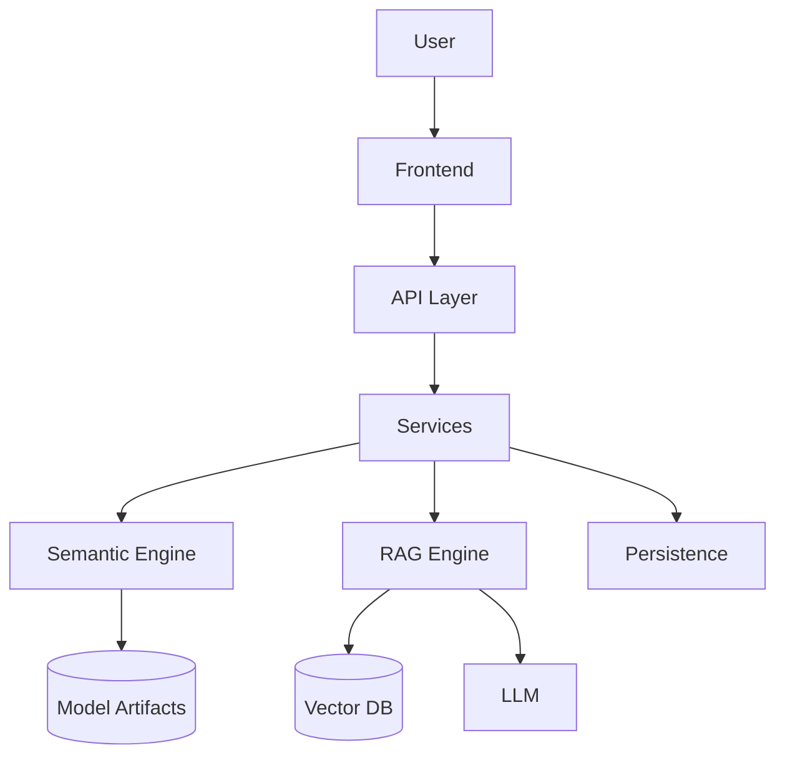

## B. Component dependency graph

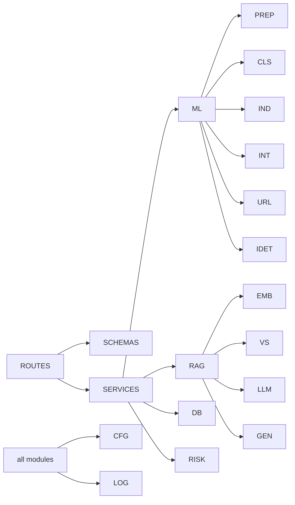

## C. Data flow diagram (decision view)

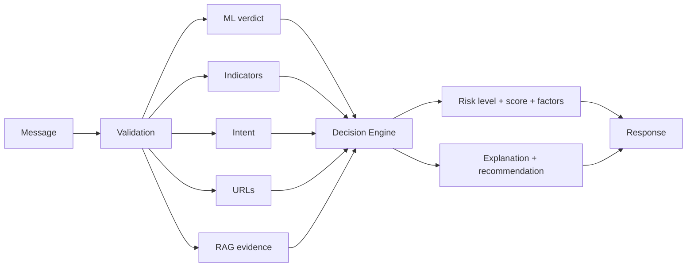

## D. Risk level decision matrix

| ML label | Intent | Confidence | Corroboration | Level |
|---|---|---|---|---|
| HAM | benign/other | ≥ 0.8 | none | LOW |
| HAM | benign/other | < 0.5 | none | UNCERTAIN |
| HAM | any | any | high indicators / flagged URL | MEDIUM–HIGH |
| SPAM | any | any | — (floor) | ≥ MEDIUM |
| SPAM | any | ≥ 0.8 | high indicators/URL/RAG family | HIGH |
| SPAM | credential/money/download | ≥ 0.85 | high indicator or flagged URL, score ≥ 80 | CRITICAL |

## E. Glossary of design terms

| Term | Meaning in this document |
|---|---|
| Orchestrator | `analysis_service.analyze()` — the single pipeline controller |
| Evidence pool | Combined indicators, URLs, intent, RAG hits feeding the decision engine |
| Factor | A human-readable risk justification line |
| Backend | A concrete implementation behind a provider/store interface |
| Grounding | Explanation claims traceable to retrieved evidence or findings |
| Provenance | Label (`template`/`llm`) declaring how an explanation was produced |
| TTL cache | Time-bounded status cache (5 s) to avoid disk reads per request |

## F. Document map

| Document | Content |
|---|---|
| `docs/PRD.md` | Requirements (what & why) |
| `docs/System_Design_Document.md` | Design (how) — this document |
| `docs/architecture.md` | Runtime topology and module responsibilities |
| `docs/ml_pipeline.md` | Dataset → model → evaluation lifecycle |
| `docs/rag_pipeline.md` | Knowledge base → index → retrieval → generation |
| `docs/api.md` | Endpoint contracts |
| `docs/setup.md` | Installation, configuration, operation |

---

## Document control

| Version | Date | Author | Change summary |
|---|---|---|---|
| 2.0 | TBD | TextShield Architecture team | Initial complete SDD aligned with PRD V2.0 and the existing implementation |