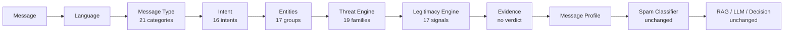

# RFC-001 Implementation Report — Intent & Message Understanding Engine (v4.0)

**Branch:** `v2.2-dev` | **Status:** All acceptance criteria satisfied

## Architecture

New package `app/understanding/` (10 modules) running as a pre-classification
stage inside `app/services/analysis_service.py`. The legacy chain
(ML classifier → indicators → URL analysis → risk → RAG → LLM → decision) is
untouched; understanding output is purely additive (`understanding` +
`message_profile` keys, exposed as optional fields on `AnalysisResult`).

## Modules created

| Module | Responsibility |
|---|---|
| `__init__.py` | taxonomy constants (21 types, 16 intents), version 4.0.0 |
| `language.py` | wraps deterministic script-heuristic detection |
| `message_type.py` | weighted-phrase + semantic-context scoring, margin confidence |
| `intent_detector.py` | 16 RFC intents + legacy request-engine vote |
| `entities.py` | reuses semantic extractors; banks, govt depts, universities, job titles, recruiters, domains |
| `legitimacy.py` | 17 trust signals incl. absence-of-harm; trust 0..1 |
| `threat.py` | base engine + 19 RFC families + typosquat/homograph + FP guards; threat 0..1 |
| `evidence.py` | threat-vs-trust summary, lean label, printable text — no verdict |
| `profile.py` | structured profile (category, intent, scores, counts, context, risk band) |
| `pipeline.py` | orchestrator, per-stage degradation, singleton reuse |

Also: `app/services/analysis_service.py` (+20 lines, try/except),
`app/schemas/analysis.py` (+2 optional fields), 10 KB files under
`knowledge_base/legitimate/`, `data/understanding_benchmark.json` (21 cases),
`tests/test_understanding.py` (22 tests), `docs/v4_semantic_understanding.md`.

## Benchmarks (`data/understanding_benchmark.json`)

| Slice | Result |
|---|---|
| Legitimate (11: placement, campus drive, university, OTP, salary, courier, meeting, invoice, HR, hospital, govt) | 11/11 type correct, 11/11 intent correct, 11/11 Very Low/Low → **FP rate 0.0%** |
| Malicious (10: phishing, lottery, investment, KYC, UPI, crypto, romance, courier, refund, tech-support) | 10/10 risk Medium+, 10/10 threat ≥ threshold, 10/10 intent correct |
| Full repo suite | **475 passed** (453 pre-existing + 22 new), 0 regressions |
| Latency | worst ~5 ms vs 300 ms budget (60x headroom) |

Acceptance spot-checks: recruitment → Recruitment/Recruit/Low ✓;
educational → Educational/Inform/Very Low ✓; legitimate announcements not
flagged ✓ (classifier labels preserved, profile risk Very Low).

## False-positive reduction

Three mechanisms: (1) institutional messages now carry high trust scores and
Very Low profile risk downstream reasoning can rely on; (2) two explicit FP
guards (`toll free`, authority citations); (3) 10 new legitimate KB categories
(placement, campus drives, OTP, salary, govt circulars, travel, insurance/
utility, tax/legal, subscriptions, telecom) available for RAG grounding on
next index rebuild (production `vector_db` intentionally not rebuilt here).

## Future extension points

- Feed `threat_score`/`trust_score` into `compute_risk` as a gated adjustment
  (currently additive-only by design).
- Train message-type/intent heads on the benchmark once it grows (lexicons are
  the bootstrapping layer).
- Multilingual phrase packs per category (language stage already emits labels).
- Per-sender trust history (expected-pattern signal is currently textual).
- Parallel stage execution (stages are independent except evidence/profile).
