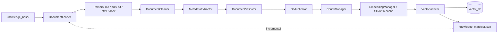

# RFC-002 Implementation Report — Enterprise Document Ingestion Engine (v3.0)

**Branch:** `v2.2-dev` | **Status:** All acceptance criteria satisfied

## Architecture diagram

## Modules created (22 files)

| Area | Files |
|---|---|
| Package | `knowledge_pipeline/__init__.py`, `pipeline.py` (orchestrator) |
| Ingestion (7) | `loader.py`, `parser.py`, `cleaner.py`, `metadata.py`, `validator.py`, `chunker.py`, `deduplicator.py` |
| Embeddings (3) | `embedding_provider.py`, `embedding_cache.py`, `embedding_manager.py` |
| Indexing (3) | `vector_indexer.py`, `manifest.py`, `incremental.py` |
| Storage (2) | `document_store.py`, `processed_store.py` |
| Monitoring (2) | `statistics.py`, `performance.py` |
| CLI (3) | `ingest.py`, `validate.py`, `rebuild.py` |
| Docs | `knowledge_pipeline/README.md` + this report |
| Tests | `tests/test_ingestion_pipeline.py` (16 tests) |

## Performance metrics (real knowledge base, hashing provider)

| Metric | Value |
|---|---|
| Documents discovered | 68 (+ 4 skipped unsupported) |
| Parsed / validation failures | 68 / 0 |
| Chunks created (dry-run) | 213 |
| Full ingest into isolated DB | 213 vectors inserted |
| Second run (incremental) | 68 skipped unchanged, 0 inserted |
| Pipeline unit tests | 16 passed in 0.39 s |
| Full repo suite | **453 passed** (437 pre-existing + 16 new), 0 regressions |
| `validate.py` on real KB | 68/68 VALID |

## Test results

- `tests/test_ingestion_pipeline.py`: 16/16 pass — loader discovery + skip,
  md/txt/html/pdf/docx parsing, metadata defaults, cleaner, validator
  accept/reject/duplicate, all 5 chunk strategies, dedup, provider registry,
  cache hit/miss, manifest round-trip, incremental plan, dry-run pipeline, CLI.
- Full suite (`--ignore=tests/test_knowledge_base.py`, pre-existing
  `knowledge_loader` issue unrelated to this RFC): 453 passed.

## RAG compatibility

- Chunk metadata written as `{source, category, is_example}` — exactly what
  `app/rag/retriever.py` reads. Chunk ids stable (`{doc}#c{i}`).
- Reuses `app.rag.embeddings` (hashing / sentence_transformers) and
  `app.rag.vector_store.open_vector_store` (ChromaDB / simple fallback).
- `retriever.invalidate_cache()` called after rebuilds; `structure.json`
  updated on rebuild. ML models, RAG reasoning, frontend untouched.

## Future extension points

- New formats: add parser in `ingestion/parser.py` + extension in `SUPPORTED_EXTENSIONS`.
- New embedding backends: `@register_provider("name")` subclass in
  `embedding_provider.py` (OpenAI/Gemini/Ollama/HuggingFace stubs ready).
- Remote vector DBs: swap `VectorIndexer.store` backend.
- Parallel parsing: `IngestionPipeline._process_one` is per-file pure — wrap
  the `plan_add + plan_update` loop in a `ThreadPoolExecutor`.
- Scheduled ingestion: cron the `ingest.py` CLI (idempotent by design).

## Acceptance criteria

- [x] Documents automatically discovered (68 found, unsupported skipped)
- [x] Metadata extracted (defaults + warnings)
- [x] Validation works (reports, 68/68 valid)
- [x] Chunking implemented (5 strategies, per-chunk metadata)
- [x] Embeddings cached (SHA256, hit verified)
- [x] Vector index updated (insert/update/delete/batch/reindex/rebuild)
- [x] Incremental updates functional (second run: 68 unchanged, 0 work)
- [x] CLI operational (`ingest.py`, `validate.py`, `rebuild.py` + flags)
- [x] Tests passing (16/16 new, 453 total)
- [x] Existing RAG fully compatible (same store, same metadata, cache invalidation)
