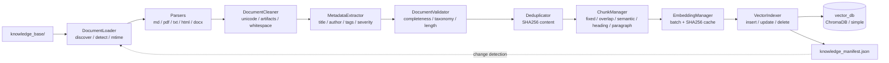

# TextShield v3.0 — Enterprise Document Ingestion Engine (RFC-002)

Fully automated, modular, incremental, fault-tolerant pipeline that converts
**Markdown, PDF, TXT, HTML, DOCX** into normalized, validated, chunked,
embedded and indexed knowledge for the existing RAG engine.

> Constraints respected: ML models untouched, RAG reasoning engine untouched,
> frontend behavior unchanged.

## Architecture



## Directory layout

```text
knowledge_pipeline/
    __init__.py
    pipeline.py            # orchestrator (discover -> ... -> manifest)
    ingestion/
        loader.py          # DocumentLoader
        parser.py          # md / pdf / txt / html / docx -> NormalizedDocument
        cleaner.py         # DocumentCleaner
        metadata.py        # MetadataExtractor
        validator.py       # DocumentValidator + ValidationReport
        chunker.py         # ChunkManager (5 strategies)
        deduplicator.py    # SHA256 content dedup
    embeddings/
        embedding_provider.py  # registry: hashing / sentence_transformers /
                               # openai / gemini / ollama / huggingface
        embedding_cache.py     # SHA256(content) -> vector cache
        embedding_manager.py   # batch embedding with cache
    indexing/
        vector_indexer.py  # insert / update / delete / batch / reindex / rebuild
        manifest.py        # knowledge_manifest.json
        incremental.py     # IncrementalTracker change plans
    storage/
        document_store.py  # raw bytes (content-addressed) + processed artifacts
    monitoring/
        statistics.py      # PipelineStatistics
        performance.py     # PerformanceMonitor per-stage timers
    cli/
        ingest.py          # full ingestion
        validate.py        # validation only
        rebuild.py         # full rebuild
```

## Supported formats

| Extension | Parser | Notes |
|---|---|---|
| `.md` / `.markdown` | front-matter + heading extraction | normalized to plain text |
| `.pdf` | pypdf → byte-scan fallback | works with zero extra deps |
| `.txt` | plain read, first line = title | |
| `.html` / `.htm` | script/style strip + entity unescape | |
| `.docx` | python-docx → manual OOXML fallback | works with zero extra deps |

All parsers emit the same `NormalizedDocument(doc_id, title, text, source_path,
extension, category, raw_metadata, warnings)`.

## CLI usage

```bash
# Ingest everything (incremental: only new/modified files processed)
python knowledge_pipeline/cli/ingest.py
python knowledge_pipeline/cli/ingest.py --folder knowledge_base/
python knowledge_pipeline/cli/ingest.py --file knowledge_base/phishing/fake_kyc.md
python knowledge_pipeline/cli/ingest.py --folder knowledge_base/ --force --verbose
python knowledge_pipeline/cli/ingest.py --dry-run

# Validate only (no writes)
python knowledge_pipeline/cli/validate.py
python knowledge_pipeline/cli/validate.py --folder knowledge_base/

# Full rebuild (clears vector store, reprocesses everything)
python knowledge_pipeline/cli/rebuild.py --force
python knowledge_pipeline/cli/rebuild.py --folder knowledge_base/ --provider hashing
```

Common flags: `--file`, `--folder`, `--category`, `--force`, `--dry-run`,
`--verbose`, plus ingest-only `--provider`, `--chunk-size`, `--chunk-overlap`,
`--strategy`, `--batch-size`.

## Manifest (`knowledge_base/knowledge_manifest.json`)

Tracks per document: `doc_id`, `file_hash`, `last_modified`, `embedding_version`,
`chunk_count`, `indexed`, `validation_status`, `category`, `size`, `source_path`,
`chunk_ids`. Incremental runs skip entries whose `file_hash` is unchanged;
deleted files are detected and their vectors removed.

## RAG compatibility

Chunk metadata written to the vector store is exactly what the retriever
expects: `{source, category, is_example}`. Chunk ids are stable
(`{category}:{stem}#c{index}` / `{doc_id}#c{index}`). After rebuilds,
`structure.json` is updated and `retriever.invalidate_cache()` is called.

## Adding a new parser

1. Add `parse_newfmt(path) -> (text, meta)` in `ingestion/parser.py`.
2. Register it in `PARSERS` and add the extension to `SUPPORTED_EXTENSIONS`
   in `knowledge_pipeline/__init__.py`.
3. Add a test in `tests/test_ingestion_pipeline.py`.

## Adding a new embedding provider

1. Subclass `BaseEmbeddingProvider` in `embeddings/embedding_provider.py`.
2. Decorate with `@register_provider("myprovider")`.
3. Implement `dimension` + `embed`. Lazy-import SDKs so the pipeline never
   crashes when optional deps are missing.

## Performance recommendations

- Keep the default `hashing` provider for CI/offline; switch to
  `sentence_transformers` for quality when PyTorch is available.
- Increase `--batch-size` (32 → 64/128) for transformer providers.
- Embedding cache (`vector_db/embedding_cache/`) makes re-runs O(changed).
- Incremental runs scale to 1000+ documents: discovery is a glob, parsing is
  per-file, embeddings are batched and cached, indexing is delta-only.
- Use `--strategy paragraph` (default, best quality/size balance);
  `heading` for long reports, `semantic` for prose, `fixed` for speed.
